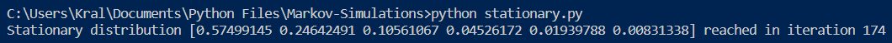
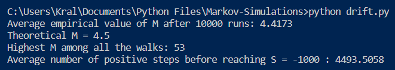
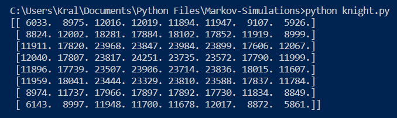
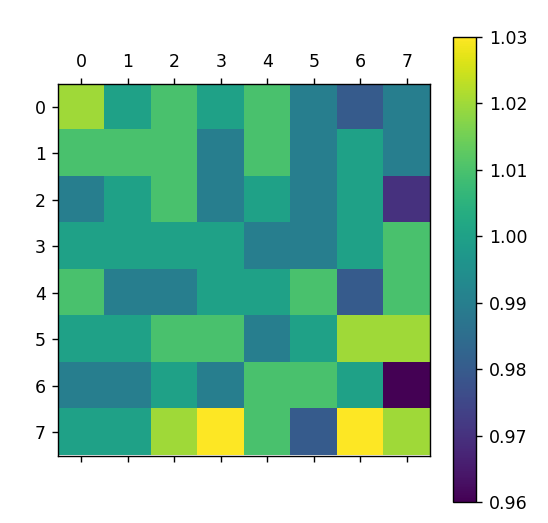

# Markov-Simulations
Numpy based simulations of Markov processes. Since the point is to demonstrate mathematical phenomena, the code does not look after the user very much. The author presumes everyone knows that probabilities are in \[ 0, 1 \] and what dimensions of vectors and matrices are multipliable. The files are described more in detail below.

### stationary.py
Simulates convergence of a Markov chain to its stationary distribution by multiplying an initial state vector with the chain's probability matrix. Iterates until a stationary state or iteration cap is reached.

### drift.py
Simulates a random walk which drifts to `-inf`. The user chooses *p*, probability of moving towards `inf`, the code returns the highest state reached, the average of this number among all iterations of the walk and how many steps in positive direction the walks took on average.

### knight.py
Simulates a random walk of a knight on a chessboard. Returns the number of visits on each square.

Functionality to return a theoretical matrix and compare it against the empirical one is also implemented. The comparison matrix shows percentage, where the theoretical matrix values are the baseline.

### static_knight.py
A scenario similar to **knight.py**, but this knight remains on its position if its randomly generated move is illegal. This makes its position's distribution uniform, hence it has lesser chance of jumping to the edge of the board, but when it gets there, it stays there longer on average.

### return_nD.py
Explores the probability of a n-dimensional random walk returning to its starting point. The return probabilities are roughly in the table below (for more information, see [mathworld](https://mathworld.wolfram.com/PolyasRandomWalkConstants.html)).

| Dimension | Return probability |
| ----------- | ----------- |
| 1 | 1 |
| 2 | 1 |
| 3 | 0.341 |
| 4 | 0.193 |
| 5 | 0.135 |
| 6 | 0.105 |
| 7 | 0.086 |

### 1D_distribution.py
Simulates a number of random walks on integers, starting at zero, with a fix amount of steps per walk. Returns an array of times each number was wisited.

### Benchmarking
The runtimes on a quadcore 10th gen i7 and 16 GB RAM are displayed in the following table.

| Program | Iterations | Runtime |
| ------- | -------- | -------- |
| `drift.py` | 1e4 | 52 sec |
| `knight.py` | 1e6 | 7 sec |
| `return_1D.py` | 1e4 | 4 sec |
| `return_2D.py` | 1e5 | 7 sec |

In all cases, a higher exponent resulted in well over a minute of computation time and does not really give any new information.
